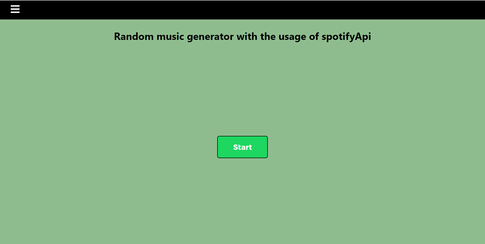
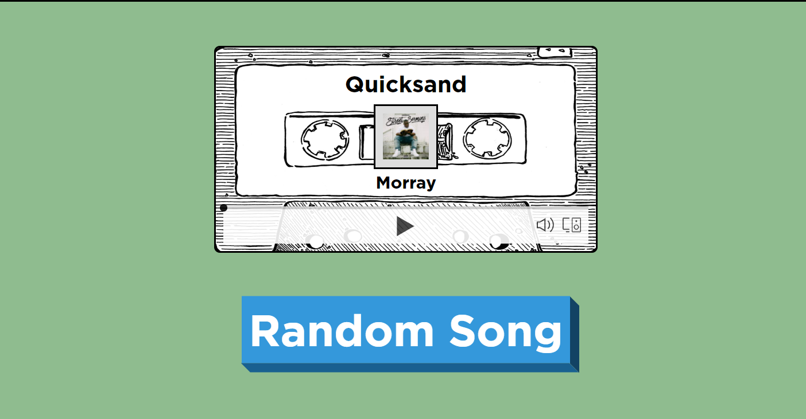
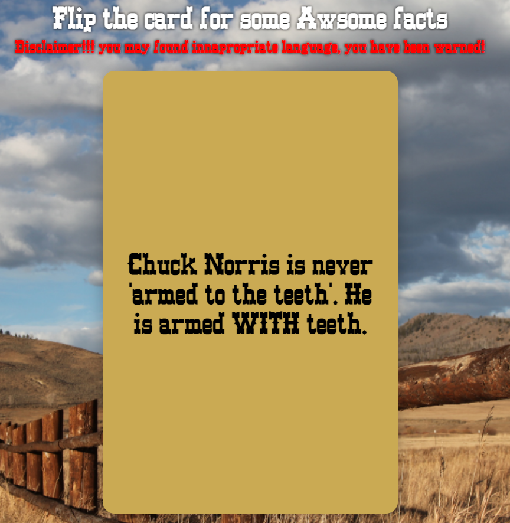
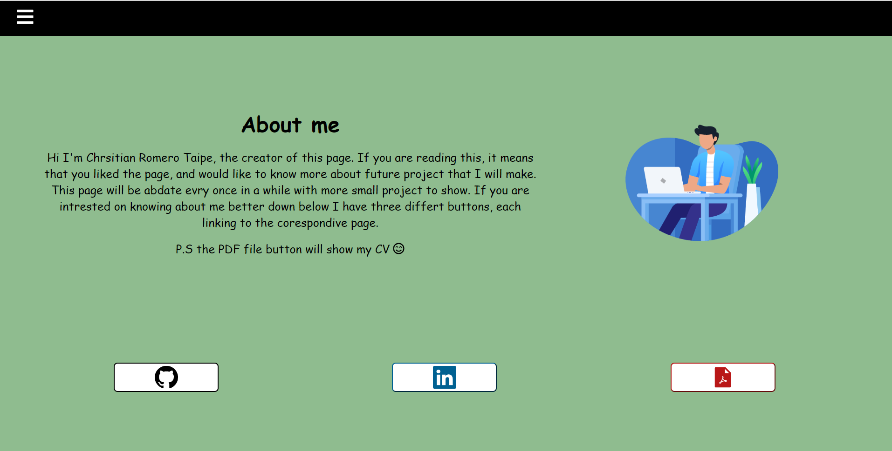

# MY FUN APP
My fun app is a web site that contains three pages

The first page is called Random Music generator, and as the name suggest it gives a random music where the user is able to play and listen.
This page make usage of the Spotify Api, and is connected to my personal account. The result given is based on the search history of Spotify, and the randomness of each song is contained by picking a random letter from the alphabet and from there randomly picking a number based on the array given from spotify api (in this case 20 songs)

START OF THE RANDOM MUSIC PAGE 

RANDOM MUSIC IN ACTION

The second page is called Chuck Fact, and is based on the mythical Chuck Norris Jokes from the community. In this case we have a card where every time the user flip it, it will get a random Chuck norris joke (Be aware you may find bad jokes too). The way this page was build is by using rapid api from this website: https://rapidapi.com/matchilling/api/chuck-norris/
 and show the data extrapolated in a fun way.
 
START OF THE CHUCK FACT PAGE 

 
 
CHUCK FACT IN ACTION

 
 
 The last page contains an About me, with three different button, one directing to my Github account, another to my Linkedin account, and the last one to a pdf of my resume.
 
 ABOUT ME PAGE
 
  
 
 In future I will probably Update the website, to have more fun interactions, so be prepared!!!

